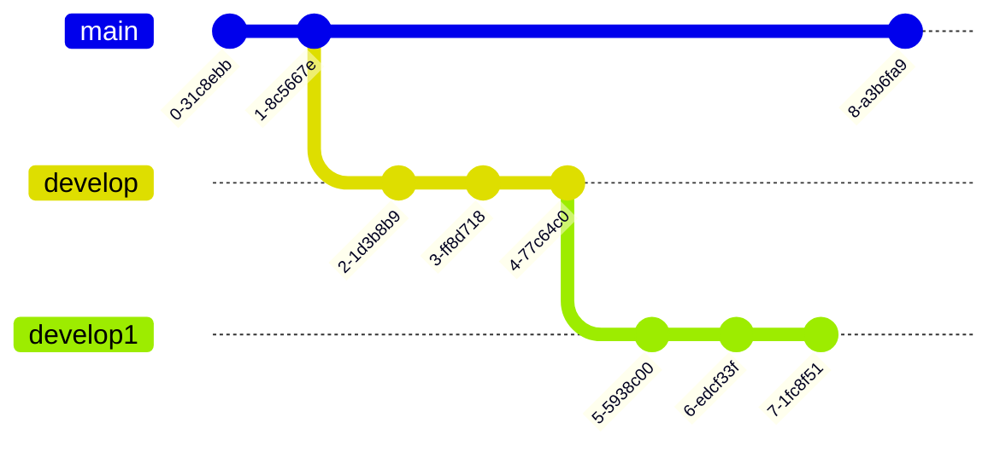
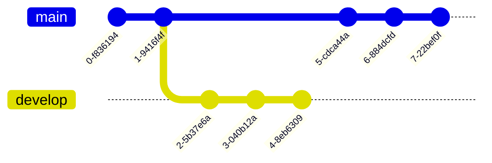

## 常用命令

commit 多个或一个文件的修改集合。

远端仓库，比如 gitlab github。非本地的仓库。

编辑器修改 -> stage -> 本地仓库 -> 远端仓库。

- git fetch 用于获取远端的信息，比如 分支信息。

- git pull 用于拉取代码，当远端修改过相同的行，可能会出现冲突。

- git push 用于推送代码，当远端出现分叉，一定会出现冲突。

- git rebase 变更分支的位置。表现是一连串的 commit 被移动到了其他地方。大概率会出现冲突。有一个很好用的参数是 --onto X A B, 把 A (不包含A) 到 B 的 commit ，迁移到以 X 为基础。

- git reset 有三种参数，--hard 会丢弃所有的改动，比较危险。--mixed 会把所有改动都列出来，从新的 commit 向旧的 commit reset 时，可以保留 commit 的改动。--soft 还没用过。

- git add , 把文件添加到 stage , 之后要确认 stage 中的改动。

- git commit, 确认 stage 中的改动，并且给一个 commit msg。commit 之后，就可以把 commit 整个推送到远端。
